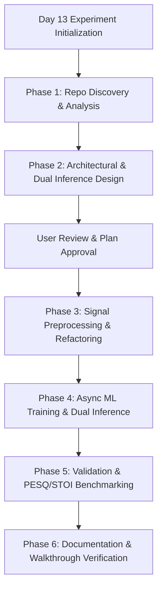

# Day 13 Experiment: Antigravity Capability Assessment & Strategy Plan

> **Notice**: Strictly isolated to Day 13 Experiment. No code inspection or repository modifications performed during this step.

---

## 1. Complete Capability Inventory & Assessment

### System Tools

#### 1. `run_command`
- **Purpose**: Executes shell commands (PowerShell/CMD on Windows) synchronously or asynchronously in the background.
- **Inputs**: `CommandLine` (string), `Cwd` (string), `WaitMsBeforeAsync` (integer).
- **Outputs**: Command stdout/stderr or background task ID.
- **Can Modify Files**: Yes (via CLI tools, scripts, git).
- **Can Execute Terminal Commands**: Yes.
- **Can Search Repositories**: Yes (via `rg`, `git grep`, `findstr`).
- **Supports Git**: Yes (direct `git` CLI commands).
- **Understands Research Papers**: Indirectly (via Python extraction scripts).
- **Supports Long-Running Autonomous Tasks**: Yes (runs as background task via `manage_task`).
- **Limitations**: Requires user authorization per command execution.

#### 2. `view_file`
- **Purpose**: Reads text or supported binary files (images, PDFs, media) with line indexing.
- **Inputs**: `AbsolutePath` (string), `StartLine` (int), `EndLine` (int), `ContentOffset` (int), `IsSkillFile` (bool).
- **Outputs**: Line-numbered text snippets or binary file metadata.
- **Can Modify Files**: No.
- **Can Execute Terminal Commands**: No.
- **Can Search Repositories**: No (inspects single file).
- **Supports Git**: No.
- **Understands Research Papers**: Yes (reads text/markdown/PDF papers).
- **Supports Long-Running Autonomous Tasks**: No.
- **Limitations**: Max 800 lines or 46,080 bytes per call.

#### 3. `write_to_file`
- **Purpose**: Creates a new file or overwrites an existing file entirely.
- **Inputs**: `TargetFile` (string), `CodeContent` (string), `Overwrite` (bool), `Description` (string), `ArtifactMetadata` (object).
- **Outputs**: File creation confirmation.
- **Can Modify Files**: Yes (creates/overwrites).
- **Can Execute Terminal Commands**: No.
- **Can Search Repositories**: No.
- **Supports Git**: No.
- **Understands Research Papers**: No.
- **Supports Long-Running Autonomous Tasks**: No.
- **Limitations**: Overwrites complete file; cannot perform line-range edits.

#### 4. `replace_file_content`
- **Purpose**: Replaces a single contiguous block of lines in an existing file.
- **Inputs**: `TargetFile`, `StartLine`, `EndLine`, `TargetContent`, `ReplacementContent`, `AllowMultiple`, `Description`, `Instruction`.
- **Outputs**: Edit status and updated line count.
- **Can Modify Files**: Yes.
- **Can Execute Terminal Commands**: No.
- **Can Search Repositories**: No.
- **Supports Git**: No.
- **Understands Research Papers**: No.
- **Supports Long-Running Autonomous Tasks**: No.
- **Limitations**: Restricted to a single contiguous block. Requires exact string match.

#### 5. `multi_replace_file_content`
- **Purpose**: Performs multiple non-contiguous block edits in a single file atomically.
- **Inputs**: `TargetFile`, `ReplacementChunks` (array of chunks), `Instruction`, `Description`.
- **Outputs**: Multi-chunk replacement status.
- **Can Modify Files**: Yes.
- **Can Execute Terminal Commands**: No.
- **Can Search Repositories**: No.
- **Supports Git**: No.
- **Understands Research Papers**: No.
- **Supports Long-Running Autonomous Tasks**: No.
- **Limitations**: TargetContent must match file text exactly. Cannot edit `.ipynb` directly.

#### 6. `grep_search`
- **Purpose**: Fast ripgrep pattern matching across workspace files and directories.
- **Inputs**: `SearchPath`, `Query`, `CaseInsensitive`, `Includes`, `IsRegex`, `MatchPerLine`.
- **Outputs**: List of matching filenames or lines with line numbers.
- **Can Modify Files**: No.
- **Can Execute Terminal Commands**: No.
- **Can Search Repositories**: Yes.
- **Supports Git**: No.
- **Understands Research Papers**: Yes (searches text/markdown paper dumps).
- **Supports Long-Running Autonomous Tasks**: No.
- **Limitations**: Max 50 matches returned per call.

#### 7. `list_dir`
- **Purpose**: Lists directory tree structure, files, sizes, and child counts.
- **Inputs**: `DirectoryPath` (string).
- **Outputs**: File/folder metadata JSON list.
- **Can Modify Files**: No.
- **Can Execute Terminal Commands**: No.
- **Can Search Repositories**: Yes (directory tree discovery).
- **Supports Git**: No.
- **Understands Research Papers**: No.
- **Supports Long-Running Autonomous Tasks**: No.
- **Limitations**: Requires existing absolute directory path.

#### 8. `search_web`
- **Purpose**: Searches the web for scientific literature, documentation, and technical resources.
- **Inputs**: `query` (string), `domain` (optional string).
- **Outputs**: Summary of search results with web citations.
- **Can Modify Files**: No.
- **Can Execute Terminal Commands**: No.
- **Can Search Repositories**: No (searches web).
- **Supports Git**: No.
- **Understands Research Papers**: Yes (finds arXiv, IEEE, ACM, GitHub repos).
- **Supports Long-Running Autonomous Tasks**: No.
- **Limitations**: Summary output; no dynamic JavaScript execution.

#### 9. `read_url_content`
- **Purpose**: Fetches HTTP web pages and converts HTML content into clean markdown text.
- **Inputs**: `Url` (string).
- **Outputs**: Markdown text of page content.
- **Can Modify Files**: No.
- **Can Execute Terminal Commands**: No.
- **Can Search Repositories**: No.
- **Supports Git**: No.
- **Understands Research Papers**: Yes (reads online papers and web docs).
- **Supports Long-Running Autonomous Tasks**: No.
- **Limitations**: Static HTML to markdown only; no authentication or JS execution.

#### 10. `invoke_subagent`
- **Purpose**: Spawns one or more background subagents to work concurrently on decoupled tasks.
- **Inputs**: `Subagents` array (containing `TypeName`, `Role`, `Prompt`, `Model`, `Workspace`).
- **Outputs**: Subagent conversation IDs.
- **Can Modify Files**: Yes (if subagent has write tools enabled).
- **Can Execute Terminal Commands**: Yes (if subagent has write tools enabled).
- **Can Search Repositories**: Yes.
- **Supports Git**: Yes (via subagent CLI execution).
- **Understands Research Papers**: Yes.
- **Supports Long-Running Autonomous Tasks**: Yes (runs asynchronously in background).
- **Limitations**: Context isolated from parent; requires message passing via `send_message`.

#### 11. `define_subagent`
- **Purpose**: Dynamically registers new specialized subagent types with customized prompts and tool access.
- **Inputs**: `name`, `description`, `system_prompt`, `enable_write_tools`, `enable_subagent_tools`, `enable_mcp_tools`.
- **Outputs**: Registered subagent definition.
- **Can Modify Files**: No (definition step only).
- **Can Execute Terminal Commands**: No.
- **Can Search Repositories**: No.
- **Supports Git**: No.
- **Understands Research Papers**: No.
- **Supports Long-Running Autonomous Tasks**: No.
- **Limitations**: Defines template; must call `invoke_subagent` to run.

#### 12. `send_message`
- **Purpose**: Transmits background updates or new instructions to running subagents.
- **Inputs**: `Recipient` (conversation ID), `Message` (string).
- **Outputs**: Transmission confirmation.
- **Can Modify Files**: No.
- **Can Execute Terminal Commands**: No.
- **Can Search Repositories**: No.
- **Supports Git**: No.
- **Understands Research Papers**: No.
- **Supports Long-Running Autonomous Tasks**: Yes (orchestrates background tasks).
- **Limitations**: Only sends to subagents, not to the user.

#### 13. `manage_subagents`
- **Purpose**: Lists active subagents or terminates specified subagents and their child trees.
- **Inputs**: `Action` ('list', 'kill', 'kill_all'), `ConversationIds`.
- **Outputs**: Subagent status list or termination summary.
- **Can Modify Files**: Deletes subagent workspaces on termination.
- **Can Execute Terminal Commands**: No.
- **Can Search Repositories**: No.
- **Supports Git**: No.
- **Understands Research Papers**: No.
- **Supports Long-Running Autonomous Tasks**: Yes.
- **Limitations**: Administrative subagent control tool.

#### 14. `manage_task`
- **Purpose**: Monitors, interacts with, or kills long-running background terminal processes.
- **Inputs**: `Action` ('list', 'kill', 'status', 'send_input'), `TaskId`, `Input`.
- **Outputs**: Task status, stdout/stderr logs, or termination confirmation.
- **Can Modify Files**: Indirectly (via background process execution).
- **Can Execute Terminal Commands**: Controls background commands.
- **Can Search Repositories**: No.
- **Supports Git**: No.
- **Understands Research Papers**: No.
- **Supports Long-Running Autonomous Tasks**: Yes (primary background process handle).
- **Limitations**: Operates only on existing background tasks.

#### 15. `schedule`
- **Purpose**: Schedules one-shot background timers or recurring cron jobs.
- **Inputs**: `DurationSeconds`, `CronExpression`, `Prompt`, `TimerCondition`, `MaxIterations`.
- **Outputs**: Scheduled task ID.
- **Can Modify Files**: No.
- **Can Execute Terminal Commands**: No.
- **Can Search Repositories**: No.
- **Supports Git**: No.
- **Understands Research Papers**: No.
- **Supports Long-Running Autonomous Tasks**: Yes (timer & cron trigger driver).
- **Limitations**: Mutually exclusive parameters (`DurationSeconds` vs `CronExpression`).

#### 16. `generate_image`
- **Purpose**: Creates or modifies visual images based on text descriptions.
- **Inputs**: `Prompt`, `ImageName`, `AspectRatio`, `ImagePaths`.
- **Outputs**: Saved image artifact path.
- **Can Modify Files**: Yes (creates image artifacts).
- **Can Execute Terminal Commands**: No.
- **Can Search Repositories**: No.
- **Supports Git**: No.
- **Understands Research Papers**: No.
- **Supports Long-Running Autonomous Tasks**: No.
- **Limitations**: Generates static raster images only.

---

### Research & Specialized Skills

#### 17. `literature-search-arxiv`
- **Purpose**: Queries arXiv for papers on STAG, IMU speech sensing, sensor fusion, and neural architectures.
- **Inputs**: Search query, author, paper ID.
- **Outputs**: Abstracts, metadata, full PDF/HTML paper access.
- **Can Modify Files**: Downloads papers locally.
- **Can Execute Terminal Commands**: No.
- **Can Search Repositories**: No.
- **Supports Git**: No.
- **Understands Research Papers**: Yes (primary arXiv tool).
- **Supports Long-Running Autonomous Tasks**: No.
- **Limitations**: Restricted to arXiv repository.

#### 18. `literature-search-openalex`
- **Purpose**: Comprehensive scholarly database search for citations, author portfolios, and open-access PDFs across IEEE/ACM/PubMed.
- **Inputs**: Concepts, DOIs, keywords.
- **Outputs**: Citation graphs, paper metadata, open-access PDFs.
- **Can Modify Files**: Downloads PDF files.
- **Can Execute Terminal Commands**: No.
- **Can Search Repositories**: No.
- **Supports Git**: No.
- **Understands Research Papers**: Yes.
- **Supports Long-Running Autonomous Tasks**: No.
- **Limitations**: API rate limits and network dependency.

#### 19. `literature-search-europepmc` / `pubmed-database`
- **Purpose**: Accesses PubMed and Europe PMC for bio-signal processing and acoustic sensing literature.
- **Inputs**: Query, PMCID, PubMed ID.
- **Outputs**: Full text BioC XML/text and structured citations.
- **Can Modify Files**: Saves text/XML papers.
- **Can Execute Terminal Commands**: No.
- **Can Search Repositories**: No.
- **Supports Git**: No.
- **Understands Research Papers**: Yes.
- **Supports Long-Running Autonomous Tasks**: No.
- **Limitations**: Focused on biomedical & life science index.

#### 20. `doc-coauthoring`
- **Purpose**: Enforces structured, API-first documentation standards and GFM styling.
- **Inputs**: Markdown draft guidelines and target files.
- **Outputs**: Formatted, readable, API-first documentation artifacts.
- **Can Modify Files**: Yes.
- **Can Execute Terminal Commands**: No.
- **Can Search Repositories**: No.
- **Supports Git**: No.
- **Understands Research Papers**: Yes (formats literature summaries).
- **Supports Long-Running Autonomous Tasks**: No.
- **Limitations**: Formatting & documentation workflow skill.

#### 21. `uv`
- **Purpose**: Rapid Python package management, environment verification, and dependency isolation.
- **Inputs**: Package names, requirements file path.
- **Outputs**: Clean Python virtualenv and installed dependencies.
- **Can Modify Files**: Yes (installs packages / updates lockfiles).
- **Can Execute Terminal Commands**: Yes (via CLI).
- **Can Search Repositories**: No.
- **Supports Git**: No.
- **Understands Research Papers**: No.
- **Supports Long-Running Autonomous Tasks**: No.
- **Limitations**: Dependent on system Python installation.

---

## 2. Capability Categorization Matrix

| Category | Primary Tools & Skills |
| :--- | :--- |
| **Repository Understanding** | `grep_search`, `list_dir`, `view_file`, `research` subagent |
| **Architecture Planning** | Planning Mode (`implementation_plan.md`), `doc-coauthoring`, `define_subagent` |
| **Machine Learning** | `run_command` (PyTorch, LightGBM, Scikit-learn), `uv`, `self` subagent |
| **Software Engineering** | `write_to_file`, `replace_file_content`, `multi_replace_file_content`, `run_command` |
| **Refactoring** | `multi_replace_file_content`, `grep_search`, `view_file` |
| **Documentation** | `write_to_file`, `doc-coauthoring`, `replace_file_content` |
| **Testing** | `run_command` (pytest, unittest), `manage_task` |
| **Debugging** | `view_file`, `run_command`, `grep_search`, `manage_task` |
| **Benchmarking** | `run_command` (profiling/benchmark scripts), `schedule`, `manage_task` |
| **Visualization** | `generate_image` (diagrams/flowcharts), standard Markdown/Mermaid tables |
| **Dataset Analysis** | `run_command` (Python data inspection scripts), `view_file` |
| **Automation** | `schedule`, `invoke_subagent`, `manage_task`, `/goal` |
| **Research Assistance** | `literature-search-arxiv`, `literature-search-openalex`, `pubmed-database`, `search_web` |
| **Git Operations** | `run_command` (`git status`, `git commit`, `git diff`, `git log`) |
| **Context & Memory Management** | `EXPERIMENT_MEMORY.md`, `ENGINEERING_JOURNAL.md`, `REPRODUCIBILITY_LOG.md` |

---

## 3. Technology & Component Capability Mapping

The **Day 13 Experiment** requires integrating 15 specific components and algorithms:

1. **InertiEAR Preprocessing**: `run_command` + custom Python modules for sensor filtering.
2. **STAG Reconstruction**: `run_command` + PyTorch model execution.
3. **StealthyIMU Compatibility**: `grep_search` + `multi_replace_file_content` to match sensor rates & channel schemas.
4. **LightGBM**: `uv` + `run_command` for gradient boosting feature baseline.
5. **DenseNet**: PyTorch vision/spectrogram feature extractor via `run_command`.
6. **Seq2Seq**: Sequence alignment and translation pipeline execution via `run_command`.
7. **BLSTM**: Bidirectional LSTM temporal acoustic decoder via `run_command`.
8. **GRU**: Gated Recurrent Unit lightweight recurrent model via `run_command`.
9. **Cubic Spline Interpolation**: `scipy.interpolate` signal resampling via Python scripts in `run_command`.
10. **Wiener Filtering**: `scipy.signal` adaptive noise reduction via Python scripts in `run_command`.
11. **Otsu Thresholding**: `cv2` or `skimage` energy mask thresholding via Python scripts in `run_command`.
12. **Spectrogram Generation**: `torchaudio` or `librosa` STFT transformation routines via `run_command`.
13. **Sensor Fusion**: Multi-modal IMU accelerometer + gyroscope alignment algorithms via `run_command`.
14. **Multi-file Refactoring**: `multi_replace_file_content` for cross-component interface refactoring.
15. **Long-running ML Engineering**: `invoke_subagent` + `manage_task` + `schedule` for non-blocking model training and profiling.

---

## 4. Phase-by-Phase Skill & Capability Recommendations

### Phase 1: Repository & Codebase Discovery
- **Recommended Tools**: `grep_search`, `list_dir`, `view_file`, `invoke_subagent` (`research`).
- **Why**: Safely inspects existing codebase structures for InertiEAR, STAG, and StealthyIMU without modifying code.
- **When**: Immediate next phase following planning approval.
- **Execution Frequency**: Repeatedly as needed during discovery.
- **Input Needed**: Target directory paths and search queries.
- **Output Produced**: Structure maps, function signatures, and tensor shapes.
- **Dependencies**: None.

### Phase 2: Architecture & Technical Design
- **Recommended Tools**: Planning Mode, `doc-coauthoring`, `write_to_file`.
- **Why**: Establishes API contracts, dual inference stream dataflow, and tensor interfaces.
- **When**: After repository analysis, before code implementation.
- **Execution Frequency**: Once (with updates upon user review).
- **Input Needed**: Findings from Phase 1.
- **Output Produced**: Formatted `IMPLEMENTATION_PLAN.md` & `ARCHITECTURE.md`.
- **Dependencies**: Phase 1 discovery.

### Phase 3: Core Module Implementation & Multi-File Refactoring
- **Recommended Tools**: `write_to_file`, `replace_file_content`, `multi_replace_file_content`, `uv`.
- **Why**: Constructs modular preprocessing (Cubic Spline, Wiener Filter, Otsu), model blocks (LightGBM, DenseNet, Seq2Seq, BLSTM, GRU), and performs atomic multi-file interface refactoring.
- **When**: During active engineering.
- **Execution Frequency**: Repeatedly for each component block.
- **Input Needed**: Approved implementation plan and file specs.
- **Output Produced**: Clean, tested module files under `Day_13_Experiment`.
- **Dependencies**: Phase 2 architecture plan.

### Phase 4: Long-Running Model Training & Dual Inference Execution
- **Recommended Tools**: `run_command` (async), `manage_task`, `schedule`, `invoke_subagent` (`self`).
- **Why**: Handles multi-hour ML training and dual-stream evaluation without blocking the agent interaction thread.
- **When**: Model training and multi-stream execution phase.
- **Execution Frequency**: Repeatedly for model training runs.
- **Input Needed**: Preprocessed dataset & training scripts.
- **Output Produced**: Model checkpoints, training logs, and loss curves.
- **Dependencies**: Phase 3 module implementation.

### Phase 5: Testing, Validation & Benchmarking
- **Recommended Tools**: `run_command` (pytest / metric scripts), `manage_task`, `write_to_file`.
- **Why**: Calculates PESQ, STOI, WER, and RTF metrics across reconstructed speech audio.
- **When**: Post-training validation.
- **Execution Frequency**: Repeatedly per benchmark iteration.
- **Input Needed**: Model checkpoints & evaluation datasets.
- **Output Produced**: `VALIDATION_RESULTS.md` & `BENCHMARK_RESULTS.md`.
- **Dependencies**: Phase 4 trained models.

### Phase 6: Documentation & Final Verification
- **Recommended Tools**: `doc-coauthoring`, `write_to_file`, `REPRODUCIBILITY_LOG.md`.
- **Why**: Verifies complete traceability, logs all modified files, updates engineering journal, and produces final walkthrough.
- **When**: Final experiment closure.
- **Execution Frequency**: Once at project conclusion.
- **Input Needed**: All experiment logs, benchmark tables, and commit history.
- **Output Produced**: Comprehensive `walkthrough.md` and complete Day 13 documentation suite.
- **Dependencies**: Phase 5 validation.

---

## 5. End-to-End Execution Workflow

---

## 6. Gap Analysis & Workarounds

1. **Gap**: Lack of a native inline GUI tensor or audio wave visualizer.
   - **Workaround**: Use `run_command` with `matplotlib`/`librosa` to save spectrograms and waveform plots as PNG images, then embed them directly into artifacts using markdown image tags (``).

2. **Gap**: Direct modification of Jupyter (`.ipynb`) notebook files via multi-replace tool.
   - **Workaround**: Convert notebooks to modular `.py` scripts using `jupytext` or standard Python modules for clean versioning and multi-replace file edits.

3. **Gap**: Real-time interactive GPU profiling dashboard.
   - **Workaround**: Execute background profiling commands (`nvidia-smi --loop=1`, `torch.utils.bottleneck`) via `run_command` (async) and monitor status through `manage_task`.

---

## 7. Best Practices for Day 13 Experiment

1. **Strict Context Isolation**: Maintain all Day 13 artifacts, memory, and code within `Day_13_Experiment/`. Never mix notes with Days 01–12.
2. **Atomic Multi-File Refactoring**: Always use `multi_replace_file_content` when changing shared function signatures across signal preprocessing and model backends.
3. **Traceability Logging**: Record every file change in `REPRODUCIBILITY_LOG.md` with Change ID, reason, and validation status.
4. **Non-Blocking Execution**: Launch multi-epoch training or heavy dataset preprocessing asynchronously using `run_command` + `manage_task`.
