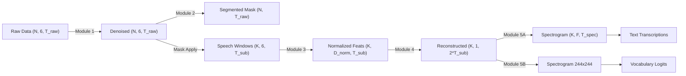

# Day 13 Dataflow Diagram

## Tensor & Signal Dataflow

## Data Types and Rates
- **Raw IMU**: 200 Hz (float32)
- **STAG Output**: 400 Hz (float32)
- **Spectrogram**: Log-Mel or STFT complex magnitudes (float32)
