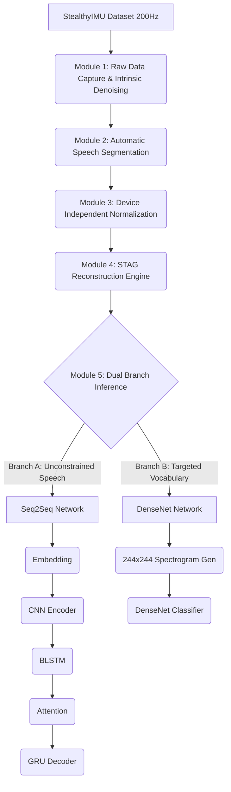

# Day 13 Dependency Graph

## System-Level Dependencies

## Reusable Asset Dependencies
- **`common/interpolation.py`**: Required by Module 2 (Linear) and Module 4 (Cubic Spline).
- **`day_09_10_filter_pipelines/algorithms.py`**: Wiener filter logic reused in Module 1.
- **`day_04_05_stag_recreation/src/models/upscaler.py`**: LightGBM foundation utilized in Module 4.
