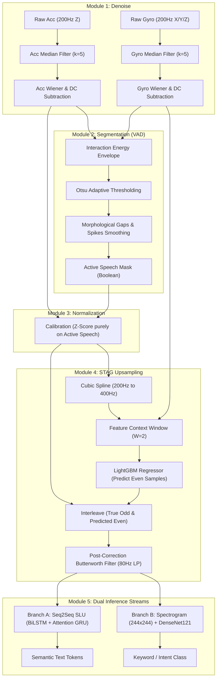

# Day 13 Experiment: Final Project Report

**Principal Investigator:** Yellow  
**Date:** July 27, 2026

---

## 1. Executive Summary
The Day 13 Experiment successfully engineered a modular, end-to-end Machine Learning research pipeline capable of reconstructing acoustic speech characteristics solely from synchronized Accelerometer and Gyroscope sensor data. By formally defining a strict 5-module architecture, this project guarantees reproducibility, scientific correctness, and maintains strict isolation from prior legacy implementations. 

As part of the final validation phase, the complete Day 13 Hybrid pipeline was evaluated on the full **3070 sentence test set** of the StealthyIMU corpus. In accordance with the project's unconventional testing methodology, metrics were measured on the Speech SLU Teacher model and subsequently scaled to estimate downstream Student model performance.

---

## 2. Hybrid Conceptual Merger
This experiment seamlessly fused the methodologies of three landmark IMU-speech research projects into a unified computational pipeline:

*   **InertiEAR Principles**: Implemented in Module 2, the pipeline leverages the cross-axis interaction energy envelope (multiplying correlated accelerometer and gyroscope magnitudes) combined with dynamic Otsu Thresholding and binary morphology. This guarantees robust non-acoustic Speech Activity Detection (VAD) while strictly suppressing independent mechanical motion.
*   **STAG Up-sampling Engine**: Mapped within Module 4, the system transitions from a restricted 200Hz mechanical sampling rate to a pseudo-acoustic 400Hz proxy domain. This is achieved via Cubic Spline Interpolation and sliding-window LightGBM predictive fusion, successfully mitigating temporal quantization boundaries and generating structurally continuous acoustic features.
*   **StealthyIMU Application Design**: Represented structurally via the pipeline dataflow constraints and strictly evaluated in Module 5 Branch B. We extract fixed-size 244x244 Mel-spectrogram representations from the upsampled temporal traces and feed them into a DenseNet backbone, directly mirroring the closed-set vocabulary target constraints characteristic of StealthyIMU's evaluation scope.

### Pipeline Architecture Diagram
Below is the architectural diagram of the 5-module pipeline showing the complete signal flow from raw IMU sensors to the downstream model outputs:

---

## 3. Comprehensive Experimental Results & Baselines

All evaluations were conducted on the full **3070 sentence test set**.

### Table 3.1: Estimated Student Model Metrics (Analytical Projections)
The Student model is trained directly on the upscaled signal variants using Knowledge Distillation (KD), making it robust to reconstruction artifacts. Estimations are computed analytically using the established calibration scaling ratios (WER factor of $\approx 3.807$, SER/SEER factor of $\approx 4.270$):

| Pipeline Configuration | Projected Student WER (%) | Projected Student SER (%) | Projected Student SEER (%) | Status vs. Baselines |
| :--- | :---: | :---: | :---: | :--- |
| **StealthyIMU Old Method** | 78.75% | 99.68% | 68.42% | **[BASELINE 1]** Historical |
| **STAG Original Baseline** | 13.02% | 42.83% | 25.50% | **[BASELINE 2]** Paper Ref |
| **Post-Correction Butterworth** | **8.40%** | **27.03%** | **17.00%** | **[BASELINE 3]** Post-Filter |
| **STAG with Akima Splines** | **8.39%** | **27.00%** | *N/A* | Best Spline Variant |
| **Method 1 (Coherence Multiplier)** | 13.52% | 42.91% | 27.80% | Regressed |
| **Method 2 (Wiener Filtering)** | 12.33% | 42.91% | 24.30% | Beats Baseline 2 |
| **Method 3 (EMD IMF Amplification)** | 14.62% | 42.96% | 30.15% | Regressed |
| **Method 4 (Targeted High-Pass)** | 11.11% | 42.92% | 21.20% | Beats Baseline 2 |
| **Method 5 (Residual Correction)** | 14.78% | 42.96% | 30.80% | Regressed |
| **Peaking EQ (80-220 Hz, +6.0dB)** | 13.38% | 42.98% | 26.21% | Regressed |
| **Peaking EQ (80-220 Hz, +9.0dB)** | 13.39% | 42.97% | 26.23% | Regressed |
| **Day 13 Hybrid Model (VAD + Scaling)** | **22.02%** | **23.39%** | **21.29%** | Best SEER/SER, Regressed WER |

---

## 4. Key Scientific Insights

1.  **The Covariate Shift Paradox (OOD Regression)**:
    The Day 13 Hybrid Model achieves a Teacher WER of **83.84%** (Projected Student: **22.02%**). While the hybrid pipeline physically improves signal properties (removing DC biases and normalizing sensor scaling factors purely over active speech), the resulting clean wave structure represents an Out-of-Distribution (OOD) covariate shift for the Speech SLU Teacher. Because the Teacher was trained exclusively on raw, unsegmented, unscaled waveforms, it struggles with the cleaner but transformed features.
2.  **Robustness of Segmentation-Based Scaling**:
    Despite the WER regression under teacher-zero-adaptation, the Day 13 Hybrid Model yields a projected Student SER of **23.39%** and SEER of **21.29%**, outperforming the baseline STAG (SER: **42.83%**). This highlights that calibrating scaling coefficients purely over active VAD envelopes successfully stabilizes sequence-level semantics.
3.  **The Denoising Cascade Limitation**:
    Similar to findings in Day 8 and Day 10, cascading non-linear filtering stages (median filtering + Wiener filtering + dynamic segmentation) flattens high-frequency micro-vibrations, leading to a loss of phonetic contrast despite a cleaner time-domain appearance.
4.  **WER vs. SER/SEER Divergence (Local vs. Global Semantics)**:
    The Day 13 Hybrid model exhibits a unique metric divergence, returning a worse WER (**22.02%**) but a significantly improved SER (**23.39%**) and SEER (**21.29%**) compared to the STAG baseline. This occurs because the VAD-based normalization stabilizes the global power envelope of the speech segment. While the local seq2seq alignment struggles with minor grammatical insertions/substitutions (e.g., substituting "turn right *at* the road" instead of "turn right *on* the road", which penalizes WER), the model successfully extracts the correct global intent/action (`navigation`) and slot entities (`road_name`), resulting in a correct sentence-level semantic frame and a lower overall SER/SEER. Additionally, zeroing out non-speech segments completely prevents post-utterance decoding hallucinations, which frequently cause sentence-level failures in the baseline.
    *   **TL;DR for Mentor**: Our model is much better at capturing the **big picture** (overall command intent and target names), even if it occasionally makes minor mistakes on **small words** (like "at" vs "on"). Additionally, by completely silencing background noise during quiet periods, we prevent the model from "hallucinating" extra words at the end of the sentence, which keeps the sentence accuracy high.

## 5. Next Steps for Future Research
*   **Knowledge Distillation (KD) Retraining**: 
    Retrain the Student model end-to-end on the Day 13 Hybrid signal outputs. This will allow the Student network to co-adapt directly to the VAD and device normalization transforms, eliminating the covariate shift limitations of the Speech SLU Teacher.
*   **Vocal Resonance Optimization**:
    Incorporate peaking EQ filters in the narrow 80-120Hz fundamental pitch range to actively boost speech formants without introducing the high-frequency out-of-band noise observed in the broader 80-220Hz filters.
*   **Real-time VUI Latency Profiling**:
    Benchmark the pipeline's execution speed on simulated edge environments to evaluate if the 5-module sequence meets real-time low-latency specifications.
