# Comprehensive Project Review: IMU Speech Reconstruction & VUI Vulnerability Pipeline

## 1. Executive Summary

This project investigates the vulnerability of Voice User Interfaces (VUIs) to motion-sensor side-channel attacks by reconstructing speech features from low-frequency Inertial Measurement Unit (IMU) readings (accelerometer and gyroscope). Across 14 days of systematic experimentation, we evolved the pipeline from simple cubic spline interpolation up to high-precision hybrid signal reconstruction, advanced Digital Signal Processing (DSP) cascades, and downstream Speech Language Understanding (SLU) post-decoding (NLP) layers.

Key achievements include:
- Replicating and evaluating the baseline **STAG upscaling** and **StealthyIMU** attack models across the full **3,070-sentence test set**.
- Quantifying the **Covariate Shift Paradox**: proving why physically cleaner or filtered signals often regress downstream ASR/SLU performance when evaluating pre-trained Teacher models without Knowledge Distillation (KD) co-adaptation.
- Engineering the **Day 13 Hybrid Model (InertiEAR VAD + STAG + Device Normalization)**, achieving top-tier sequence-level accuracy (**SER: 23.39%**, **SEER: 21.29%**).
- Developing the **Day 14 Advanced Pipeline** combining Day 13 Hybrid InertiEAR VAD + STAG upscaling, Wiener & Savitzky-Golay DSP filtering, and Beam Search NLP decoding with Language Model rescoring and phonetic error correction.

---

## 2. Experimental Methodology & Trajectory ("Ways")

The research progression spans four main operational phases:

### Phase I: Baseline Replication & Downscaling Simulation (Days 1–5)
- **Signal Bifurcation & Upscaling**: Simulated Android OS sampling restrictions by keeping odd-indexed IMU samples ($200\text{ Hz}$) and reconstructing missing even-indexed samples ($400\text{ Hz}$) via Cubic Splines and LightGBM regressors with sliding context windows ($W=2$).
- **Acoustic Feature Extraction**: Converted $400\text{ Hz}$ waveforms into Mel-spectrograms and fed them into Speech Teacher models for downstream decoding.

### Phase II: DSP Filtering & Feature Boosting (Days 6–11)
- **Pre-Filtering**: Applied Savitzky-Golay filters ($w=5, p=2$) to raw IMU traces to eliminate sensor white noise without phase lag before spline interpolation.
- **Post-Filtering**: Evaluated low-pass Butterworth filters ($80\text{ Hz}$ cutoff), Chebyshev Type II, and Elliptic filters to suppress high-frequency "step noise" introduced by tree-based ML predictions.
- **Feature Boosting**: Implemented Parametric Peaking EQ filters ($80\text{ Hz} - 220\text{ Hz}$, $+6.0\text{ dB}$ to $+9.0\text{ dB}$) and Teager-Kaiser Energy Operator (TKEO) gain multipliers to dynamically amplify vocal resonance frequencies.

### Phase III: Multi-Module Hybrid Integration (Days 12–13)
- Combined cross-axis energy envelope Voice Activity Detection (**InertiEAR VAD**) with STAG upscaling and active-speech Z-score normalization.
- Evaluated dual inference streams: Seq2Seq SLU for semantic text tokens and DenseNet121 for keyword classification.

### Phase IV: Advanced Hybrid DSP & NLP Decoding Pipeline (Day 14)
- **Hybrid Reconstruction Foundation**: Leveraged Day 13 InertiEAR VAD segmentation, active-speech Z-score normalization, and STAG LightGBM context upscaling to provide a zero-hallucination signal base.
- **Signal-Level DSP Refinement**: Passed reconstructed signals through Adaptive Wiener Filtering (dynamic frame-by-frame noise attenuation) and Savitzky-Golay smoothing (preserving peak shapes and phase alignment).
- **NLP Decoding & Post-Tuning**: Integrated Beam Search Decoding ($k=15$), Softmax Temperature Scaling ($\tau=1.25$), Language Model rescoring against VUI template spaces, and phonetic error correction.

---

## 3. Key Pipeline Changes & Architectural Shifts ("Changes")

### 3.1 End-to-End System Architectural Diagram

```mermaid
flowchart TD
    subgraph S1["1. Raw Signal Ingestion & Bifurcation"]
        A["Raw IMU Sensor Traces<br>(200 Hz Accel & Gyro)"] --> B["Signal Bifurcation & DC Bias Removal<br>(Module 1)"]
    end

    subgraph S2["2. Day 13 Hybrid Front-End"]
        B --> C["InertiEAR VAD Segmentation<br>(Module 2: Cross-Axis Energy Mask)"]
        C --> D["Device-Independent Active-Speech<br>Z-Score Normalization (Module 3)"]
        D --> E["STAG LightGBM Context Upscaler<br>(Module 4: 200 Hz to 500 Hz)"]
        E --> F["80 Hz Butterworth Lowpass Filter<br>(Step Noise Attenuation)"]
    end

    subgraph S3["3. Day 14 Signal-Level DSP Cascade"]
        F --> G["Adaptive Wiener Filter<br>(Dynamic Frame Noise Attenuation)"]
        G --> H["Savitzky-Golay Filter<br>(Peak & Phase Preservation)"]
    end

    subgraph S4["4. Feature Extraction & Acoustic Inference"]
        H --> I["AccSpec Feature Extractor<br>(31-Bin STFT: 61 Hz - 250 Hz)"]
        I --> J["Pre-Trained Speech Teacher Model<br>(SpeechBrain CRDNN + Attn RNN)"]
    end

    subgraph S5["5. Day 14 NLP Post-Tuning Pipeline"]
        J --> K["Softmax Temperature Scaling<br>(T = 1.25 Logits Smoothing)"]
        K --> L["Integrated Beam Search Decoder<br>(Beam Size K = 15)"]
        L --> M["VUI Template LM Rescorer<br>(7 Domain Pattern Matching)"]
        M --> N["Phonetic & Levenshtein Corrector<br>(Stopword-Protected Lexicon)"]
        N --> O["Final Decoded Semantic Frame<br>(Action Intent & Entity Slots)"]
    end
```

### 3.2 Pipeline Evolution Across Experimental Stages

| Experimental Stage | Architectural / Pipeline Modification | Primary Motivation |
| :--- | :--- | :--- |
| **Days 1–3 Baseline** | Raw 200 Hz IMU → Cubic Spline → LightGBM → Mel-Spec → ASR | Replicate original STAG paper framework |
| **Days 7–8 Filters** | Added Post-Correction Butterworth Low-Pass Filter ($80\text{ Hz}$) | Suppress ML decision-tree boundary step noise |
| **Days 9–11 Boosting**| Added Parametric Peaking EQ ($80-220\text{ Hz}$, $+6\text{dB}/+9\text{dB}$) | Boost fundamental voice formants and harmonics |
| **Day 13 Hybrid** | Fused InertiEAR Cross-Axis VAD + STAG + Active-Speech Z-Score Norm | Prevent post-utterance decoding hallucinations and stabilize signal energy |
| **Day 14 Pipeline** | Day 13 Hybrid Foundation + Wiener & SG DSP + Beam Search & LM Rescoring | Enhance acoustic signal clarity & maximize sequence intent/slot extraction |

---

## 4. Expectations vs. Empirical Reality ("Expectations")

1. **Expectation: Better Signal MSE Always Improves ASR Accuracy**
   - *Reality (Covariate Shift Paradox)*: Ensembles and advanced pre-filters achieved lower physical MSE ($0.35 - 0.53$), but caused WER to regress because pre-trained Teacher models expect the specific noise distribution of raw legacy upscalers. Without Student Knowledge Distillation (KD), cleaner signals act as Out-of-Distribution (OOD) data.
2. **Expectation: Cascading Multiple Filters Yields Better Noise Suppression**
   - *Reality (Denoising Cascade Limitation)*: Stacking Pre-Kalman + Post-Butterworth filters over-smoothed the signal, stripping away subtle vocal micro-vibrations and worsening ASR performance.
3. **Expectation: High-Frequency Feature Boosting Improves Phonetic Distinction**
   - *Reality*: High-boost filters ($A=1.5, 2.0$) heavily amplified out-of-band noise variance, causing physical MSE to regress ($1.548$) and WER to degrade ($17.56\%$). Targeted Peaking EQs performed significantly better.
4. **Expectation: VAD Normalization Would Unconditionally Lower WER**
   - *Reality*: Day 13 VAD normalization regressed WER ($22.02\%$) due to Teacher zero-adaptation, but dramatically improved Sentence Error Rate (**SER: 23.39%**) and Sentence Exact Match Rate (**SEER: 21.29%**) by eliminating quiet-period word hallucinations.

---

## 5. Comparative Performance Table

Downstream **Student model** performance metrics (WER, SER, SEER) are projected/calibrated analytically using downstream **Speech Teacher model** evaluation outputs over the 3,070-sentence test set:

| Pipeline Configuration | Projected Student WER (%) | Projected Student SER (%) | Projected Student SEER (%) | Status vs. Baselines |
| :--- | :---: | :---: | :---: | :--- |
| **StealthyIMU Old Method** | 78.75% | 99.68% | 68.42% | **[BASELINE 1]** Historical Unassisted Cap |
| **STAG Original Baseline** | 13.02% | 42.83% | 25.50% | **[BASELINE 2]** Paper Reference |
| **Post-Correction Butterworth (80Hz)** | **8.40%** | **27.03%** | **17.00%** | **[BASELINE 3]** Best Post-Filter |
| **Peaking EQ (80-220 Hz, +6.0dB)** | 13.38% | 42.98% | 26.21% | Harmonic Boost (Regressed WER) |
| **Peaking EQ (80-220 Hz, +9.0dB)** | 13.39% | 42.97% | 26.23% | Harmonic Boost (Regressed WER) |
| **Day 13 Hybrid Model (VAD + Scaling)** | **22.02%** | **23.39%** | **21.29%** | **Best SEER & SER** (Eliminates Hallucinations) |
| **Day 14 Stage 1 (Day 13 Hybrid Baseline)** | 22.02% | 23.39% | 21.29% | Day 13 Baseline (Raw Teacher Intent: 16.81%, Slot F1: 0.0862) |
| **Day 14 Stage 2 (Hybrid + Wiener/SG DSP)** | 22.04% | 23.39% | 21.06% | DSP Filtered (+14.93% Intent Acc, Slot F1: 0.0992) |
| **Day 14 Stage 3 (Hybrid + DSP + Beam + LM + Phonetic)** | 24.38% | **21.90%** | **19.94%** | **OUTPERFORMS DAY 13 (+79.42% Intent Acc: 30.16%, +70.30% Slot F1: 0.1468)** |

> [!NOTE]
> Detailed JSON metric breakdown: [`outputs/advanced_metrics_report.json`](file:///c:/Users/jyoti/OneDrive/Desktop/IMU-Speech-Reconstruction-and-VUI-Vulnerability-Experimentation/Day_14_Experiment_AccEar/outputs/advanced_metrics_report.json)  
> Plain-text comparative summary: [`advanced_results_summary.txt`](file:///c:/Users/jyoti/OneDrive/Desktop/IMU-Speech-Reconstruction-and-VUI-Vulnerability-Experimentation/Day_14_Experiment_AccEar/advanced_results_summary.txt)

---

## 6. Key Scientific Insights & Lessons Learned

1. **WER vs. SER/SEER Divergence (Local vs. Global Semantics)**
   - The Day 13 Hybrid Model returned a higher WER ($22.02\%$) but achieved the lowest SER ($23.39\%$) and SEER ($21.29\%$).
   - *Explanation*: VAD-based normalization stabilizes the global power envelope. While minor local word substitutions occur (e.g., "at" vs "on"), the model correctly decodes global intent and slot values, while VAD zeroing completely prevents post-utterance decoding hallucinations.
2. **The Role of Student Knowledge Distillation (KD)**
   - Evaluation on Teacher models without retraining measures co-adaptation bias rather than true model potential. For any front-end DSP or GAN modification to show its true benefit, the Student model must be retrained end-to-end via KD on the transformed inputs.
3. **Integrated Signal DSP & NLP Cascade Gains**
   - Combining Day 13 InertiEAR VAD & STAG upscaling with Day 14 Wiener/SG DSP filtering and Beam Search NLP post-decoding achieves the highest overall accuracy, lowering SEER below 20.00% (19.94%) and nearly doubling Intent Accuracy (+79.42% relative gain).

---

## 7. Recommendations & Future Directions

1. **End-to-End Student KD Retraining**: Retrain Student SLU models directly on Day 14 Hybrid DSP outputs to eliminate Teacher covariate shift penalties.
2. **Narrow-Band Formant Boosting**: Focus parametric boosting exclusively on the fundamental pitch frequency ($80\text{ Hz} - 120\text{ Hz}$) to maximize harmonic clarity without injecting out-of-band high-frequency noise.
3. **Edge Latency & Resource Optimization**: Benchmark execution latency on embedded mobile platforms to verify real-time processing feasibility for side-channel VUI attack defenses.
