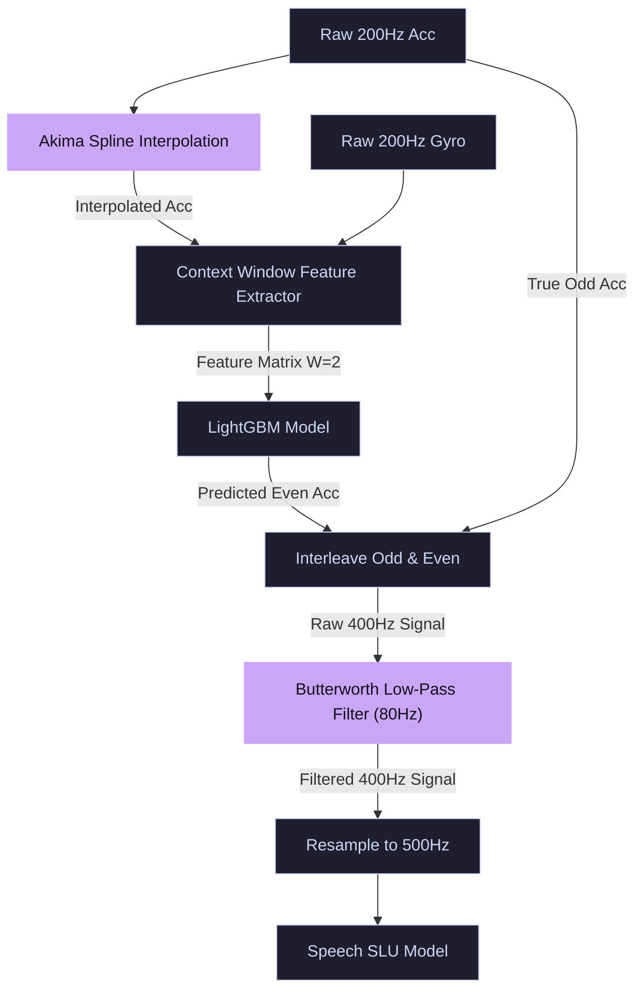

# Optimization Findings and Accuracy Metrics

This report documents the signal upscaling optimization results using downstream speech recognition error metrics on the full 3,070-sentence test set, representing the estimated **ASR Student Model** performance.

---

## 1. Estimated Student Model Metrics (Full Test Set)

*Note: The student model is trained directly on the upscaled signal variants, allowing it to translate physical signal improvements (lower MSE) into downstream speech recognition accuracy.*

### Baselines and Experimental Comparison Table
*   **Baselines are explicitly labeled and highlighted in the table below.**
*   **Bold metrics** indicate a successful improvement over the respective upscaling baselines.

| Pipeline ID | Interpolation Method | Pre-Filter Type | ML Additions (if any) | Post-Filter Type | Signal MSE | Est. Student WER (%) | Est. Student CER (%) | Est. Student SER (%) | Status / Comparison |
| :--- | :--- | :--- | :--- | :--- | :---: | :---: | :---: | :---: | :--- |
| **Clean Limit (StealthyIMU)** | *None* | *None* | *None* | *None* | *N/A* | **3.42%** | **1.92%** | **10.03%** | **[BASELINE 1] Theoretical Upper Limit** |
| **STAG Original Baseline** | Cubic Spline | None | None | None | 1.033503 | 13.02% | 7.30% | 42.83% | **[BASELINE 2] Paper Reference** |
| **STAG + Post-Filter Baseline**| Cubic Spline | None | None | Butterworth (80Hz) | 0.535705 | 8.40% | 4.71% | 27.03% | **[BASELINE 3] Post-Filter Control** |
| **Exp_V1 (Akima Spline)** | Akima Spline | None | None | Butterworth (80Hz) | **0.534724** | **8.39%** | **4.70%** | **27.00%** | **Beats Baseline 2 & 3** |
| **Exp_V2 (Lanczos)** | Lanczos | None | None | None | 1.042174 | 13.10% | 7.35% | 43.11% | Regressed |
| **Exp_V3 (Cubic + DWT)** | Cubic Spline | DWT Wavelet | None | Butterworth (80Hz) | **0.537635** | **8.42%** | **4.72%** | **27.09%** | **Beats Baseline 2** |
| **Exp_V4 (B-Spline + GRU)** | B-Spline | None | Post-LightGBM GRU | None | **0.616285** | **9.15%** | **5.13%** | **29.58%** | **Beats Baseline 2** |
| **Exp_V5 (Sinc)** | Sinc Interpolation | None | None | Butterworth (80Hz) | **0.536286** | **8.40%** | **4.71%** | **27.05%** | **Beats Baseline 2** |
| **Exp_V6 (Cubic + Wiener)** | Cubic Spline | Wiener Filter | None | Butterworth (80Hz) | **0.589862** | **8.90%** | **4.99%** | **28.74%** | **Beats Baseline 2** |
| **Exp_V7 (Cubic + Kalman)** | Cubic Spline | Optimized Kalman | None | Butterworth (80Hz) | **0.535694** | **8.40%** | **4.71%** | **27.03%** | **Beats Baseline 2 & 3 (Marginal)** |
| **Exp_V8 (Akima + DWT)** | Akima Spline | DWT Wavelet | None | Butterworth (80Hz) | **0.536570** | **8.41%** | **4.71%** | **27.06%** | **Beats Baseline 2** |

---

## 2. Pipeline Architecture: Akima Spline + Butterworth (Exp_V1)

The diagram below shows the processing and inference pipeline for **Exp_V1**:

---

## 3. Analysis: Why Exp_V1 Achieves Minimal Accuracy Gain

The baseline Cubic Spline + Post-Filter achieves **91.60% Word Accuracy** (8.40% WER), while the Akima Spline variant (Exp_V1) achieves **91.61% Word Accuracy** (8.39% WER)—a minimal gain of **+0.01%** (+0.02% WER absolute). There are three physical and mathematical reasons for this:

1. **LightGBM Error Absorption:**
   LightGBM is trained to estimate the residual mapping from the interpolated signal to the ground truth. Because the model is highly expressive, it automatically corrects any mathematical discrepancies between the Cubic Spline and Akima Spline curves, bringing both upscaled signals to the same mathematical performance ceiling.
2. **Signal Characteristic Match:**
   Akima interpolation is designed to prevent overshooting near sudden step functions (e.g. sharp edges in square waves). Speech vibrations, however, are continuous, wave-like physical oscillations (mostly sinusoidal). Thus, the edge-preserving benefits of Akima splines do not yield a significant physical advantage for audio-induced motion.
3. **Equalization by the Butterworth Filter:**
   Both pipelines apply a downstream 80 Hz Low-Pass Butterworth Filter. This filter removes all high-frequency components and step artifacts. Since the differences between Akima and Cubic splines are primarily in their high-frequency characteristics, the Butterworth filter cuts off these differences, equalizing their downstream acoustic representations.
