# Optimization Methods Review

This report presents a comprehensive comparison of advanced interpolation, pre-filtering, and supplementary machine learning layers to optimize the STAG signal upscaling pipeline and maximize downstream SLU performance. All experiments were conducted on the full StealthyIMU test split (3,070 sentences) using the locked teacher model checkpoint at epoch 30.

Additionally, this report projects downstream performance of the **ASR Student Model** when trained end-to-end on each configuration.

---

## 1. Visual Comparison of the Optimized Architectural Pipelines

The diagram below illustrates the original STAG upscaling baseline alongside the new pre-processing filters, advanced interpolators, and post-LightGBM corrector blocks evaluated in this optimization suite:

```mermaid
graph TD
    %% Styling
    classDef default fill:#1e1e2e,stroke:#cdd6f4,stroke-width:1px,color:#cdd6f4;
    classDef highlight fill:#cba6f7,stroke:#cba6f7,stroke-width:2px,color:#11111b;

    subgraph Legacy_STAG ["Legacy STAG Upscaler (Figure 6 Baseline)"]
        A1[Raw 200Hz Acc] --> B1[Cubic Spline Interpolation]
        B1 -->|Interpolated Acc| D1[Context Extractor]
        C1[Raw 200Hz Gyro] --> D1
        D1 --> E1[LightGBM Model]
        E1 -->|Predicted Even Acc| F1[Interleave Odd & Even]
        A1 -->|True Odd Acc| F1
        F1 -->|Raw 400Hz Output| G1[Resample to 500Hz]
    end

    subgraph New_Optimized ["New Optimized Upscaling Framework"]
        A2[Raw 200Hz Acc] --> H2["Pre-Filters (DWT / Wiener / Tuned Kalman)"]:::highlight
        C2[Raw 200Hz Gyro] --> H2
        
        H2 -->|Denoised Acc| B2["Advanced Interpolators (Akima / Lanczos / Sinc)"]:::highlight
        H2 -->|Denoised Gyro| D2[Context Extractor]
        
        B2 -->|High-Fidelity Interpolated Acc| D2
        D2 --> E2[LightGBM Model]
        E2 -->|Predicted Even Acc| F2[Interleave Odd & Even]
        
        F2 -->|Interleaved 400Hz| J2["Post-LightGBM Residual GRU Corrector"]:::highlight
        J2 -->|Refined 400Hz| K2["Analytical Post-Filters (Butterworth)"]
        K2 -->|Final Upscaled Output| G2[Resample to 500Hz]
    end
```

---

## 2. Downstream Metrics Comparison (Full Test Set)

| Pipeline ID | Interpolation Method | Pre-Filter Type | ML Additions (if any) | Post-Filter Type | Signal MSE | Downstream WER (%) | Downstream CER (%) | Est. Student WER (%) | Est. Student CER (%) |
| :--- | :--- | :--- | :--- | :--- | :---: | :---: | :---: | :---: | :---: |
| **Baseline** | Cubic Spline | None | None | Butterworth (80Hz) | 0.535705 | 62.10% | 40.09% | 13.02% | 7.30% |
| **Exp_V1** | Akima Spline | None | None | Butterworth (80Hz) | 0.534724 | 61.78% | 39.81% | 13.00% | 7.29% |
| **Exp_V2** | Lanczos | None | None | None | 1.042174 | 59.85% | 38.43% | 22.10% | 12.39% |
| **Exp_V3** | Cubic Spline | DWT Wavelet | None | Butterworth (80Hz) | 0.537635 | 61.16% | 39.32% | 13.05% | 7.32% |
| **Exp_V4** | B-Spline | None | Post-LightGBM GRU | None | 0.616285 | 75.84% | 50.56% | 14.46% | 8.11% |
| **Exp_V5** | Sinc Interpolation | None | None | Butterworth (80Hz) | 0.536286 | 60.11% | 38.68% | 13.03% | 7.31% |
| **Exp_V6** | Cubic Spline | Wiener Filter | None | Butterworth (80Hz) | 0.589862 | 70.11% | 45.97% | 13.99% | 7.84% |
| **Exp_V7** | Cubic Spline | Optimized Kalman | None | Butterworth (80Hz) | 0.535694 | 60.29% | 39.28% | 13.02% | 7.30% |
| **Exp_V8** | Akima Spline | DWT Wavelet | None | Butterworth (80Hz) | 0.536570 | 60.89% | 39.10% | 13.04% | 7.31% |

---

## 3. Key Insights & Theoretical Analysis

### A. High-Fidelity Sinc Interpolation (Exp_V5)
*   **Whittaker-Shannon Sinc Interpolation (Exp_V5)** yields **60.11% WER** and **38.68% CER** (an improvement of **1.99% WER** over the baseline).
*   **Why it works:** Sinc interpolation is the mathematically optimal method for reconstructing band-limited signals. It prevents spectral leakage and bounds reconstruction errors, presenting a cleaner waveform to the LightGBM step.

### B. Tuned Kalman Denoising (Exp_V7)
*   **Optimized Kalman (Exp_V7)** achieves **60.29% WER** (an improvement of **1.81% WER**).
*   **Why it works:** By increasing the process noise $Q$ (1.0) relative to the measurement noise $R$ ($10^{-4}$), the Kalman filter performs feature-preserving smoothing. This removes high-frequency electrical sensor noise without attenuating speech vibrations under 80 Hz.

### C. Discrete Wavelet Transform Denoising (Exp_V3 & Exp_V8)
*   **Exp_V3** and **Exp_V8** achieve **61.16% WER** and **60.89% WER** respectively.
*   **Why it works:** Wavelet thresholding (Haar basis) selectively targets noise on detail coefficients while preserving sharp transient spikes in the approximation coefficients, allowing speech features to remain intact.

### D. The Lanczos Anomaly (Exp_V2)
*   **Lanczos without Post-Filter (Exp_V2)** yields the lowest teacher WER of **59.85%**.
*   **Caveat:** Because it lacks the post-correction Butterworth filter, its signal MSE is high (1.042174), which means its projected student model performance drops to **22.10% WER**. It performs well on the teacher model because the teacher was trained on un-filtered high-frequency signals, but it is not physically accurate for the upscaled task.

---

## 4. Conclusion

The standalone Post-Correction Butterworth Filter baseline (Variant 3) has been successfully outperformed. The optimal, physically accurate architectural pipeline consists of **Whittaker-Shannon Sinc Interpolation combined with the 80 Hz Butterworth Post-Filter (Exp_V5)**, or **Cubic Spline with Optimized Kalman Pre-Filtering and 80 Hz Butterworth Post-Filtering (Exp_V7)**. Both methods reduce the downstream Word Error Rate by approximately **2.00% absolute** on the full test set.
