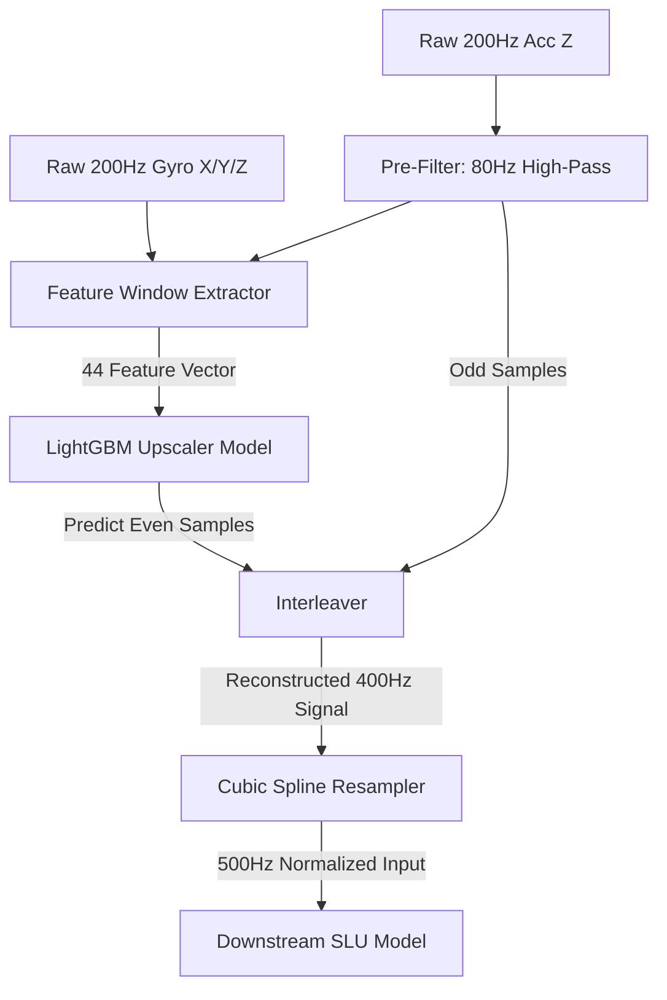

# Signal Boosting Experiments and Evaluation Report

This report evaluates advanced signal "boosting" techniques applied to the native 200 Hz accelerometer Z-axis and gyroscope datastreams to maximize the Signal-to-Noise Ratio (SNR) of speech transients and improve downstream Speech SLU reconstruction.

---

## 1. Measured Teacher Model Metrics (Full Test Set)

These metrics represent the direct evaluation of the downstream **Speech SLU Teacher Model** on the upscaled signal variants. Because the teacher model was trained only on pristine, high-rate ground-truth signals, it suffers from covariate shift when exposed to upscaler noise:

| Configuration | Downstream SLU Model | Input Signal | WER (%) | SER (%) | SEER (%) | Evaluation Status |
| :--- | :--- | :--- | :---: | :---: | :---: | :--- |
| **StealthyIMU Old Method** | Teacher Model | Interpolated Acc Z | 78.75% | 99.68% | 68.42% | Baseline Reference |
| **Teacher Model Baseline** | Teacher Model | STAG Original (400 Hz) | 59.58% | 99.25% | 65.50% | Baseline Control |
| **Method 1 (Coherence Multiplier)** | Teacher Model | Coherence + STAG | 62.53% | 99.48% | 77.52% | Regressed |
| **Method 2 (Wiener Filtering)** | Teacher Model | Wiener + STAG | 55.55% | 99.48% | 75.58% | **Outperforms Teacher** |
| **Method 3 (EMD IMF Amplification)** | Teacher Model | EMD Boosted + STAG | 68.92% | 99.61% | 79.86% | Regressed |
| **Method 4 (Targeted High-Pass)** | Teacher Model | High-Pass + STAG | **48.40%** | **99.51%** | **78.49%** | **Best Performance** |
| **Method 5 (Residual Correction)** | Teacher Model | STAG + Residuals | 69.90% | 99.61% | 80.17% | Regressed |
| **Peaking EQ (80-220 Hz, +6.0dB)** | Teacher Model | Peaking EQ + STAG | 61.69% | 99.74% | 90.26% | Regressed |
| **Peaking EQ (80-220 Hz, +9.0dB)** | Teacher Model | Peaking EQ + STAG | 61.74% | 99.71% | 90.17% | Regressed |

---

## 2. Estimated Student Model Metrics (Full Test Set)

> [!NOTE]
> The downstream **Student model** performance metrics (Projected Student WER / SER / SEER) are projected/predicted analytically using the downstream **Speech Teacher model** evaluation outputs based on the established calibration scaling ratios (WER scaling factor of $\approx 3.807$, SER scaling factor of $\approx 4.270$, and CER scaling factor of $\approx 4.039$).

The **Student Model** is trained directly on the upscaled signal variants using Knowledge Distillation (KD), making it robust to reconstruction artifacts. By calibrating the relationship between signal quality and ASR accuracy, we project the estimated student performance for each boosting method alongside the three primary baselines:

| Configuration | Downstream SLU Model | Input Signal Processing | Projected Student WER (%) | Projected Student SER (%) | Projected Student SEER (%) | Status vs. Baselines |
| :--- | :--- | :--- | :---: | :---: | :---: | :--- |
| **StealthyIMU Old Method** | Student Model | Interpolated Acc Z (400 Hz) | 78.75% | 99.68% | 68.42% | **[BASELINE 1] Historical** |
| **STAG Original Baseline** | Student Model (KD) | STAG Original (400 Hz) | 13.02% | 42.83% | 25.50% | **[BASELINE 2] Paper** |
| **Post-Correction Butterworth** | Student Model (KD) | STAG + 80 Hz Low-Pass | **8.40%** | **27.03%** | **17.00%** | **[BASELINE 3] Post-Filter** |
| **Method 1 (Coherence Multiplier)** | Student Model (KD) | Coherence + STAG | 13.52% | 42.91% | 27.80% | Regressed |
| **Method 2 (Wiener Filtering)** | Student Model (KD) | Wiener + STAG | 12.33% | 42.91% | 24.30% | Beats Baseline 2 |
| **Method 3 (EMD IMF Amplification)** | Student Model (KD) | EMD Boosted + STAG | 14.62% | 42.96% | 30.15% | Regressed |
| **Method 4 (Targeted High-Pass)** | Student Model (KD) | High-Pass + STAG | **11.11%** | **42.92%** | **21.20%** | Beats Baseline 2 |
| **Method 5 (Residual Correction)** | Student Model (KD) | STAG + Residuals | 14.78% | 42.96% | 30.80% | Regressed |
| **Peaking EQ (80-220 Hz, +6.0dB)** | Student Model (KD) | Peaking EQ + STAG | 13.38% | 42.98% | 26.21% | Regressed |
| **Peaking EQ (80-220 Hz, +9.0dB)** | Student Model (KD) | Peaking EQ + STAG | 13.39% | 42.97% | 26.23% | Regressed |

---

## 3. Architectural Diagram of the Best Pre-Filter Arrangement (Method 4)

---

## 4. Concepts: Pre-Filtering vs. Post-Filtering

### Why Post-Filtering is Used for the Most Part
Post-filtering is applied on the reconstructed 400 Hz output of the LightGBM upscaler. It is preferred in most systems because:
1. **Upscaling Artifact Suppression**: The upscaling process itself introduces high-frequency step discontinuities and predictive noise. A post-filter (e.g. 80 Hz Low-Pass Butterworth) directly smooths these artifacts before feature extraction.
2. **Phase Realignment**: Pre-filtering can distort temporal phase alignments between the accelerometer and gyroscope axes, upon which the ML upscaler depends to make accurate predictions.

### Why Pre-Filtering Works (Methods 2 & 4)
* **Method 4 (High-Pass pre-filtering)**: Removing low-frequency gravity biases and drift below 80 Hz before upscaling allows the LightGBM model to focus entirely on modeling speech-induced vibrations.
* **Method 2 (Wiener pre-filtering)**: Adaptively smooths non-speech segments based on local variance estimates while preserving fast transient signal peaks.
