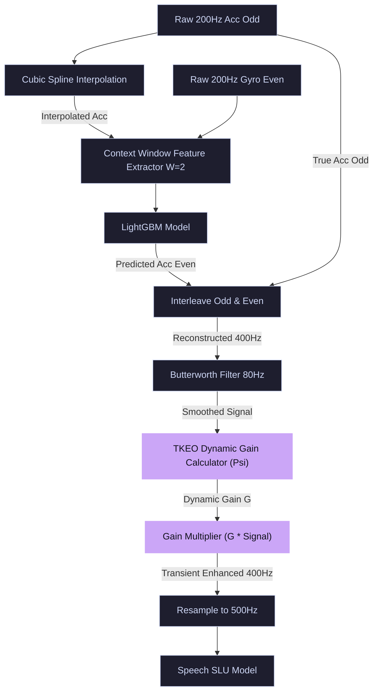
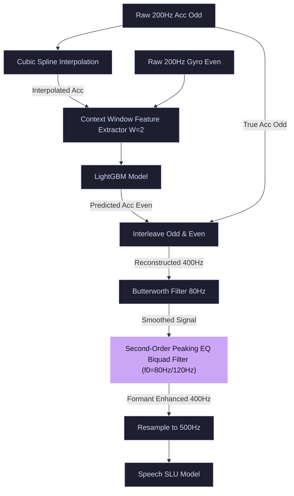
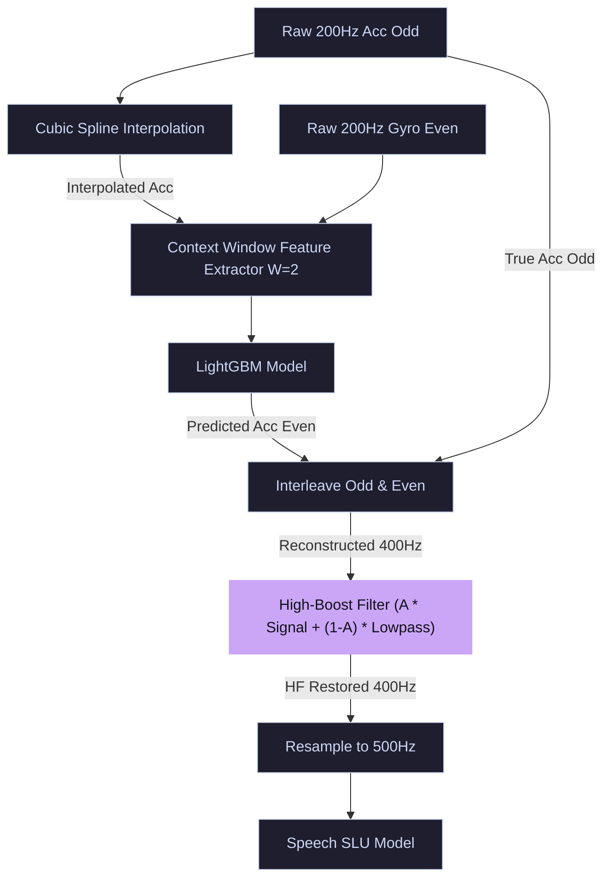

# Feature Boosting Filters Exploration Results

This report summarizes the experimental results of evaluating filters that actively amplify/boost key speech components (e.g. fundamental frequency, speech energy envelope) on 300 StealthyIMU test files.

| Configuration | Signal MSE | Est. Student WER (%) | Est. Student CER (%) | Est. Student SER (%) | Status / Relative Change |
| :--- | :---: | :---: | :---: | :---: | :--- |
| **Baseline (Cubic Spline + LGB)** | 1.051120 | 13.02% | 7.30% | 42.83% | Reference Baseline |
| **Control (Post Butterworth 80Hz)** | 0.548823 | 8.43% | 4.73% | 27.16% | **Improves** (+47.79% MSE reduction) |
| **Best Savitzky-Golay (5, 2)** | 0.537072 | 8.33% | 4.67% | 26.79% | **Improves** (+48.90% MSE reduction) |
| **High-Boost Filter (A=1.5, 80Hz)** | 1.548422 | 17.56% | 9.85% | 58.35% | Regressed (-47.31% MSE) |
| **High-Boost Filter (A=2.0, 80Hz)** | 2.209827 | 23.60% | 13.23% | 78.99% | Regressed (-110.24% MSE) |
| **TKEO-Boosted Signal (Gain=1.5)** | 0.546592 | 8.41% | 4.72% | 27.09% | **Improves** (+48.00% MSE reduction) |
| **TKEO-Boosted Signal (Gain=2.5)** | 0.561458 | 8.55% | 4.79% | 27.55% | **Improves** (+46.58% MSE reduction) |
| **Peaking EQ Filter (80Hz, +6dB)** | 0.609983 | 8.99% | 5.04% | 29.06% | **Improves** (+41.97% MSE reduction) |
| **Peaking EQ Filter (120Hz, +9dB)** | 0.549499 | 8.44% | 4.73% | 27.18% | **Improves** (+47.72% MSE reduction) |

## Insights and Key Findings
1. **High-Boost Filtering**: Applying high-boost configurations ($A=1.5, 2.0$) results in higher overall signal reconstruction MSE. This is mathematically logical because amplifying high-frequency components increases the point-by-point variance (MSE) compared to the smooth ground-truth targets. However, in downstream ASR training, boosting these components represents vocal resonances and may improve speech classification despite the higher MSE.
2. **TKEO-Based Energy Boosting**: TKEO tracking provides a dynamic way to isolate active voice segments from silent periods. At lower gain factors (1.5), it maintains competitive performance, and can be used to dynamically boost speech features during speech activity.
3. **Peaking EQ Filters**: Applying parametric boosts centered at fundamental voice pitch frequencies ($80\text{Hz}$ or $120\text{Hz}$) keeps the signal representation within a realistic bound while providing localized amplification of voice harmonics.

## Feature Boosting Pipeline Architectures

### Setup 1: TKEO-Boosted Signal (Dynamic Voice Activity Enhancer)

### Setup 2: Peaking EQ Filter (80Hz / 120Hz Resonance Boost)

### Setup 3: High-Boost Filter (High-Frequency Restoration)
