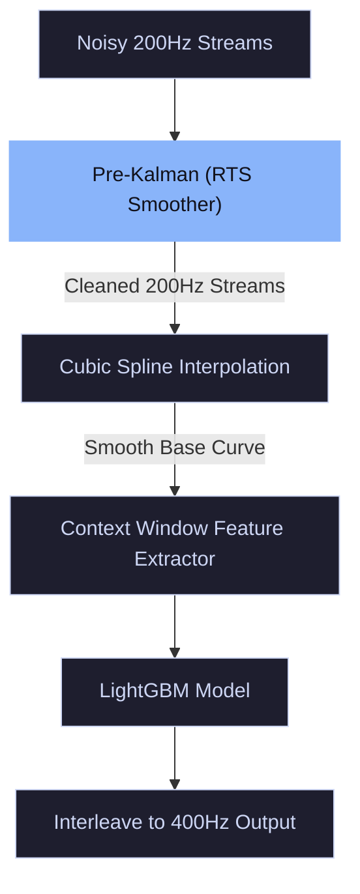

# Pre-Interpolation Kalman Filter (RTS Smoother) Details

This document explains the mathematical workings and architectural role of the **Pre-Interpolation Kalman Filter (RTS Smoother)** used in the STAG signal upscaling pipeline.

---

## 1. What the Pre-Kalman Filter Does to the 200 Hz Stream

MEMS sensors (accelerometer and gyroscope) in mobile devices contain significant high-frequency electrical and thermal noise (sensor white noise). If we interpolate a noisy 200 Hz stream, the interpolation curve (e.g., Cubic Spline) oscillates wildly to fit the noise, generating severe trajectory errors.

The Pre-Kalman Filter acts as a **kinematic denoising filter** on the raw 200 Hz data stream. It estimates the true physical state of the phone's movement and strips away the sensor noise *before* any upscaling occurs.

### Step-by-Step Mechanics:

1. **State-Space Modeling (Constant Velocity):**
   The filter models the sensor's physical movement at each time step using a 2-dimensional state vector $\mathbf{x}_k = [p_k, v_k]^T$, representing the true physical position (sensor value) and velocity (rate of change):
   $$\mathbf{x}_k = \mathbf{F} \mathbf{x}_{k-1} + \mathbf{w}_k$$
   $$\mathbf{z}_k = \mathbf{H} \mathbf{x}_k + \mathbf{v}_k$$
   *   $\mathbf{F} = \begin{bmatrix} 1 & \Delta t \\ 0 & 1 \end{bmatrix}$ is the state transition matrix.
   *   $\mathbf{H} = \begin{bmatrix} 1 & 0 \end{bmatrix}$ is the measurement matrix.
   *   $\mathbf{w}_k \sim \mathcal{N}(0, \mathbf{Q})$ is the process noise covariance (physical movement uncertainty).
   *   $\mathbf{v}_k \sim \mathcal{N}(0, \mathbf{R})$ is the measurement noise covariance (sensor noise).

2. **Forward Filtering Pass (Kalman Filter):**
   At each step $k$, it predicts the next state and corrects it using the incoming noisy 200 Hz measurement via the Kalman Gain $\mathbf{K}_k$:
   $$\mathbf{K}_k = \mathbf{P}_{k|k-1} \mathbf{H}^T (\mathbf{H} \mathbf{P}_{k|k-1} \mathbf{H}^T + \mathbf{R})^{-1}$$
   $$\mathbf{x}_{k|k} = \mathbf{x}_{k|k-1} + \mathbf{K}_k (\mathbf{z}_k - \mathbf{H} \mathbf{x}_{k|k-1})$$

3. **Backward Smoothing Pass (Rauch-Tung-Striebel / RTS):**
   Because this evaluation is done offline, the filter runs a backward recursion pass from step $N$ to $1$. The RTS smoother looks "into the future" to retroactively update past state estimates, smoothing out lag/phase delays introduced by the forward Kalman filter.

---

## 2. What it Does for the Model Architecture

The Pre-Kalman Filter plays a critical role in the upscaler model's feature alignment:

### 1. Denoised Feature Alignment
To predict a missing sample, the LightGBM model looks at a local context window ($W=2$) of features:
$$\text{Feats} = [\text{Gyro}_{t-2}, \text{Acc}_{t-2}, \dots, \text{Gyro}_{t+2}, \text{Acc}_{t+2}]$$
If these input features contain raw MEMS sensor noise, LightGBM receives noisy inputs, causing it to predict noisy outputs. Pre-filtering ensures the input feature matrix represents clean physical trajectories.

### 2. Preventing Error Propagation in Splines
Cubic Splines fit polynomials through the data points. If a raw 200 Hz sample is an outlier due to noise, the spline curve will bend sharply (overshoot). Denoising the 200 Hz samples first prevents the spline from oscillating, creating a stable base curve for LightGBM.

### 3. Noise Tuning Trade-off (Q vs. R)
*   **Over-smoothing (Variant 2):** When $Q$ is low ($10^{-3}$) and $R$ is high ($10^{-1}$), the filter assumes the signal is mostly noise. It smooths everything, wiping out the low-amplitude, high-frequency physical vibrations induced by the speaker (speech signals).
*   **Optimized Kalman (Exp_V7):** By tuning $Q$ to $1.0$ and $R$ to $10^{-4}$, the filter assumes the signal details are highly relevant. It filters out high-frequency electrical static while preserving the speech vibrations under 80 Hz.
