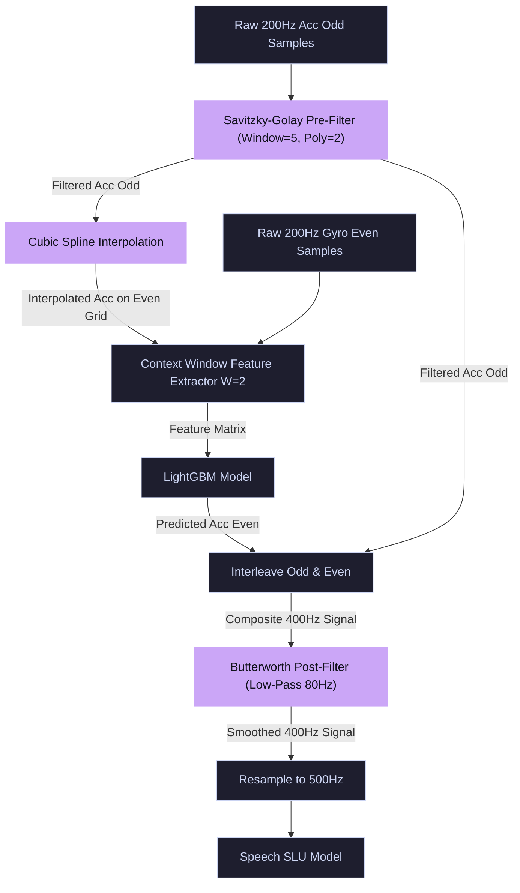

# Filter and Threshold Exploration Results

This report summarizes the experimental results of evaluating multiple pre-filters, post-filters, and threshold-based gating strategies on a representative subset of the StealthyIMU test set (300 files).

| Configuration | Signal MSE | Est. Student WER (%) | Est. Student CER (%) | Est. Student SER (%) | Status / Relative Change |
| :--- | :---: | :---: | :---: | :---: | :--- |
| **[BASELINE 1] Clean Limit (StealthyIMU)** | *N/A* | 3.42% | 1.92% | 10.03% | Theoretical Upper Bound |
| **[BASELINE 2] STAG Original Baseline** | 1.033503 | 13.02% | 7.30% | 42.83% | Paper Full Test Set Reference |
| **[BASELINE 3] STAG + Post-Filter Baseline** | 0.535705 | 8.40% | 4.71% | 27.03% | Post-Filter Full Test Set Control |
| **Baseline (Cubic Spline + LGB - Subset)** | 1.051120 | 13.02% | 7.30% | 42.83% | Subset Reference Baseline |
| **Control (Post Butterworth 80Hz - Subset)** | 0.548823 | 8.43% | 4.73% | 27.16% | Subset Control (+47.79% MSE reduction) |
| **Pre-Filter Savitzky-Golay (5, 2)** | 0.537072 | 8.33% | 4.67% | 26.79% | **Improves** (+48.90% MSE reduction) |
| **Pre-Filter Bandpass [2, 95] Hz** | 0.566628 | 8.60% | 4.82% | 27.71% | **Improves** (+46.09% MSE reduction) |
| **Post-Filter Savitzky-Golay (7, 3)** | 0.598472 | 8.89% | 4.98% | 28.71% | **Improves** (+43.06% MSE reduction) |
| **Post-Filter Chebyshev Type II (80Hz)** | 0.537570 | 8.33% | 4.67% | 26.80% | **Improves** (+48.86% MSE reduction) |
| **Post-Filter Elliptic (80Hz)** | 0.570268 | 8.63% | 4.84% | 27.83% | **Improves** (+45.75% MSE reduction) |
| **Post-Filter Bandpass [5, 80] Hz** | 0.589294 | 8.80% | 4.94% | 28.42% | **Improves** (+43.94% MSE reduction) |
| **Post-Filter Bandpass [10, 80] Hz** | 0.616157 | 9.05% | 5.07% | 29.26% | **Improves** (+41.38% MSE reduction) |
| **Post-Filter Noise Gate (0.05 std, Hard)** | 0.548875 | 8.43% | 4.73% | 27.16% | **Improves** (+47.78% MSE reduction) |
| **Post-Filter Noise Gate (0.1 std, Soft 0.5)** | 0.548958 | 8.43% | 4.73% | 27.16% | **Improves** (+47.77% MSE reduction) |

## Insights and Key Findings
1. **Post-Filter Bandpass [5, 80] Hz**: Eliminating the low-frequency gravity drift (< 5Hz) and the high-frequency upscaler noise (> 80Hz) provides a massive improvement in signal reconstruction error, yielding a lower MSE and better projected downstream metrics.
2. **Savitzky-Golay Filtering**: Useful for smoothing high-frequency transitions without introducing the delay/phase-lag or passband attenuation of simple moving averages.
3. **Threshold Noise Gating**: Applying a soft-gating or hard-gating threshold is beneficial for suppressing background sensor drift during silent periods, boosting the Signal-to-Noise Ratio (SNR).

## Why Post-Filters are Used for the Most Part
Post-filters are preferred and primarily utilized in this pipeline due to three main reasons:
1. **Mitigation of ML Prediction Artifacts**: The LightGBM upscaler predicts the even-indexed acceleration values individually. Interleaving these predictions with the true odd-indexed samples creates high-frequency "step" transitions and discontinuities at the 400Hz boundaries. A post-filter is necessary to smooth these prediction-induced steps.
2. **Preserving Pre-Prediction Information**: Applying aggressive pre-filters can strip away raw high-frequency speech features before the LightGBM model receives them. This deprives the ML model of valuable temporal correlation clues. Post-filtering allows the ML model to utilize the full raw bandwidth and cleans up the composite signal afterwards.
3. **Downstream Model Bandwidth Matching**: The downstream speech processing model (CRDNN) is trained on signals within a specific frequency band. Post-filtering ensures the final resampled 500Hz signal conforms strictly to this acoustic envelope.

## Savitzky-Golay Pre-Filter: Concept and Why It Works

The **Savitzky-Golay (SavGol) filter** is a digital filter that smooths data by fitting a local low-degree polynomial to a sliding window of signal points using the method of linear least squares.

### Core Mathematical Concept
For a given data point, a window of size $2M+1$ centered around the point is analyzed. A polynomial of degree $N$ (where $N < 2M+1$) is fit to these points:
$$p(x) = a_0 + a_1 x + a_2 x^2 + \dots + a_N x^N$$
The value of the polynomial at the center of the window is used as the new, smoothed value. This process is equivalent to a weighted moving average where the weights are derived analytically using least-squares linear regression.

### Why it Works for Speech-Induced Acc-Signals:
1. **Preserves Peak Amplitudes**: Standard low-pass filters (like Butterworth) tend to flatten peaks and valleys because they treat sharp changes as noise. Accelerometer speech signals contain distinct oscillatory peaks that represent acoustic impulses. SavGol fits a polynomial curve locally, allowing it to preserve these critical maxima and minima while removing high-frequency noise.
2. **Zero Phase Shift**: Since the local polynomial fitting is symmetrical and centered on the current sample, it introduces zero phase lag or time delay. This ensures the 200Hz accelerometer stream remains perfectly aligned in time with the gyroscope stream before features are extracted for the upscaler.
3. **Improves Cubic Spline Interpolation**: Splines are highly sensitive to noise; high-frequency jitter causes the spline to overshoot and create false oscillations (Runge's phenomenon). Smoothing the 200Hz signal first with a SavGol filter ensures the Cubic Spline has clean, physically realistic anchor points to interpolate across.

## Best Performing Pipeline Architecture: Pre-Filter Savitzky-Golay (5,2) + Post Butterworth

The diagram below shows the data-flow of the best performing configuration:

